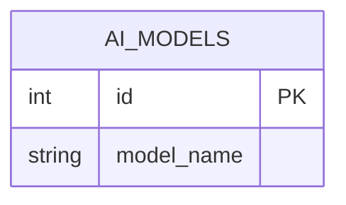

# TABLE ai_models
---

---

## Table Schema

| Column Name  | type    | Length | Constraints | Nullable | Remark           |
| ------------ | ------- | ------ | ----------- | -------- | ---------------- |
| `id`         | INT     |        | PRIMARY KEY | N        | `AUTO INCREMENT` |
| `model_name` | varchar | 20     |             | N        |                  |

## Simple Value

| Column Name  | Simple |
| ------------ | ------ |
| `id`         | 1      |
| `model_name` | GPT    |