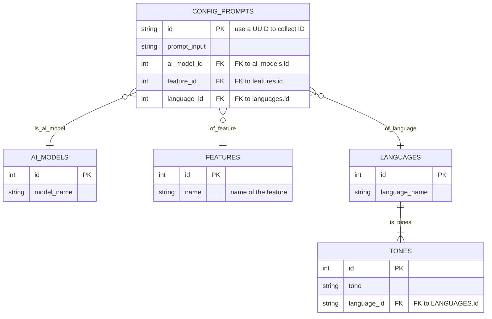

#  CONFIG | Database_Diagrams

```mermaid
erDiagram
    CONFIG_PROMPTS }o--|| AI_MODELS: is_ai_model
    CONFIG_PROMPTS{
        string id PK "use a UUID to collect ID"
        string prompt_input 
        int ai_model_id FK "FK to ai_models.id"
        int feature_id FK "FK to features.id"
        int language_id FK "FK to languages.id"
    }
    AI_MODELS{
        int id PK
        string model_name
    }
    CONFIG_PROMPTS }o--|| FEATURES: of_feature
    FEATURES{
        int id PK
        string name "name of the feature" 
    }
    CONFIG_PROMPTS }o--|| LANGUAGES: of_language
    LANGUAGES{
        int id PK
        string language_name
    }

    LANGUAGES ||--|{ TONES: is_tones
    TONES{
        int id PK 
        string tone 
        string language_id FK "FK to LANGUAGES.id"
    }
    
```
