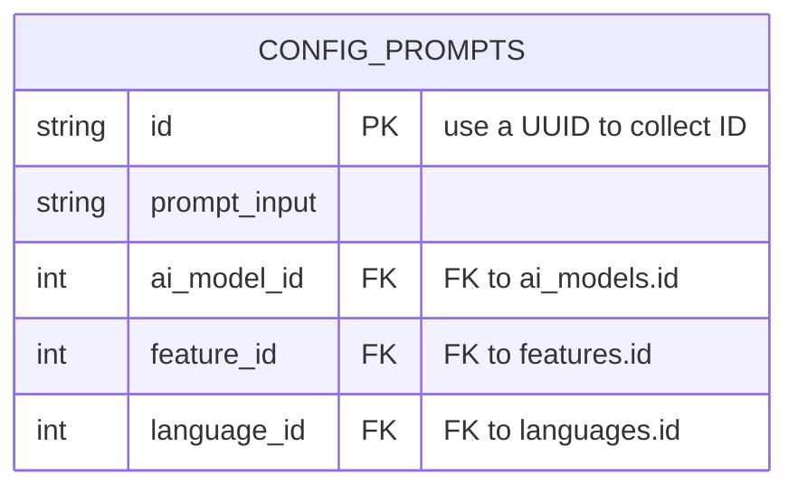

# TABLE config_prompts
---

---

## Table Schema

| Column name    | type    | Length | Constraints | Nullable | Remark                                  |
| -------------- | ------- | ------ | ----------- | -------- | --------------------------------------- |
| `id`           | VARCHAR | 255    | Primary Key | N        | UUID (V7 with timestamp) GENERATE       |
| `prompt_input` | VARCHAR | 4000   |             | N        | prompt for send to `generative ai` text |
| `ai_model_id`  | int     |        | Foreign Key | N        |                                         |
| `feature_id`   | int     |        | Foreign Key | N        |                                         |
| `language_id`  | int     |        | Foreign Key | N        |                                         |

## Simple Value

| Column Name    | Simple                                                                                                                                               |
| -------------- | ---------------------------------------------------------------------------------------------------------------------------------------------------- |
| `id`           | 018f42bb-cc9d-7023-b916-b13131b8c261                                                                                                                 |
| `prompt_input` | Create list of idea content with short biref about [ {input}] that all content should make feeling like [{type}] show list of idea with short biref: |
| `ai_model_id`  | 1                                                                                                                                                    |
| `feature_id`   | 1                                                                                                                                                    |
| `language_id`  | 1                                                                                                                                                    |