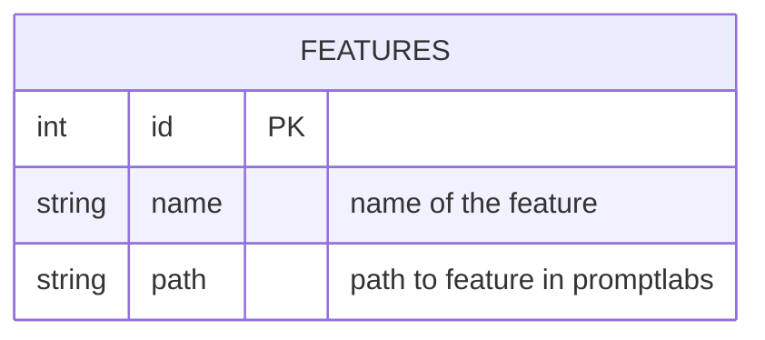

# TABLE features
---

## Table Schema

| Column name | type    | Length | Constraints | Nullable | remark |
| ----------- | ------- | ------ | ----------- | -------- | ------ |
| `id`        | int     |        | Primary Key | N        |        |
| `name`      | varchar | 255    |             | N        |        |
| `path`      | varchar | 255    |             | N        |        |

## Simple Value

| Column Name | Simple               |
| ----------- | -------------------- |
| `id`        | 1                    |
| `name`      | เขียนแคปชั่นขายของ      |
| `path`      | `/createSellingPost` |