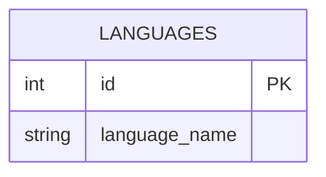

# TABLE languages
---

---

## Table Schema

| Column name     | type    | Length | Constraints | Nullable | Remark |
| --------------- | ------- | ------ | ----------- | -------- | ------ |
| `id`            | INT     |        |             | N        |        |
| `language_name` | VARCHAR | 5      |             | N        |        |

## Simple Value
| Column Name     | Simple |
| --------------- | ------ |
| `id`            | 1      |
| `language_name` | th     |
