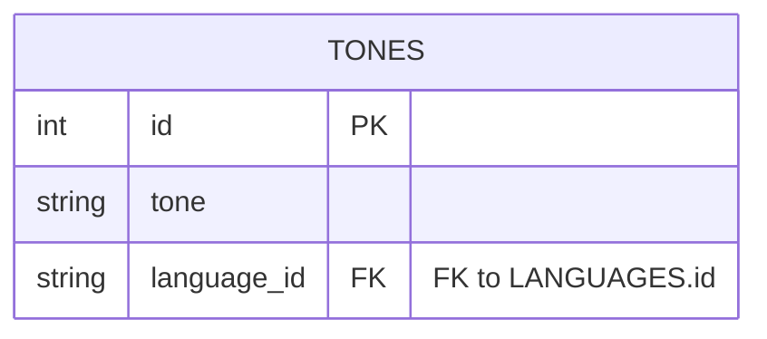

# TABLE Tones
---

---
## Table Schema
| Column Name   | type    | Length | Constraints | Nullable | Remark |
| ------------- | ------- | ------ | ----------- | -------- | ------ |
| `id`          | INT     |        | Primary Key | N        |        |
| `tone`        | VARCHAR | 100    |             | N        |        |
| `language_id` | INT     |        |             | N        |        |

## Simple Value
| Column Name   | Simple  |
| ------------- | ------- |
| `id`          | 1       |
| `tone`        | สนุกสนาน |
| `language_id` | 1       |