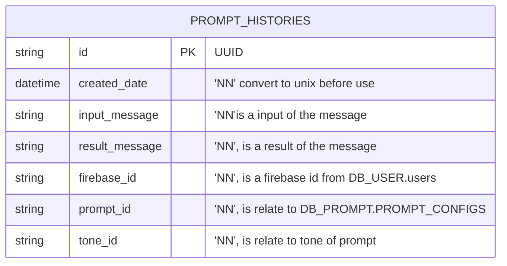

# TABLE prompt_histories v1.0.0

---

## Table Schema
| Column name       | type    | Length | Constraints | Nullable | Remark       |
| ----------------- | ------- | ------ | ----------- | -------- | ------------ |
| `id`     | VARCHAR | 36     | PRIMARY KEY |  NN       | UUID |
| `created_date`     | DATETIME |      |   |   NN      |  |
| `input_message`     | TEXT |      |   |   NN      | a input of the message |
| `result_message`     | TEXT |      |   |   NN      | a result of the message |
| `firebase_id`     | VARCHAR |   50   |   |   NN      | a firebase id from DB_USER.users |
| `prompt_id`     | VARCHAR |  255    |   |   NN      | relate to DB_PROMPT.PROMPT_CONFIGS |
| `tone_id`     | INT |      |   |   NN      | relate to tone of prompt |

## Simple Value
| Column Name       | Simple           |
| ----------------- | ---------------- |
| `id`     |  ab383fbc-b345-4290-bb5a-0e9877ffdd3b |
| `input_message` | iPhone 32              |
| `result_message` | ## iPhone 32: อัปเกรดความสนุกแบบพลิกโฉม 📱🎉 เตรียมตัวพบกับสุดยอดนวัตกรรมความมันส์ ที่จะมอบประสบการณ์อันน่าตื่นเต้นเหนือระดับ 💥\n iPhone 32 มาพร้อมกับ: ..... more              |
|`firebase_id`| 3xf49S9a8bN1Zt2kjPx |
|`prompt_id` |   018f42bb-cc9d-7023-b916-b13131b8c261 |
| `tone_id`  |   1      |