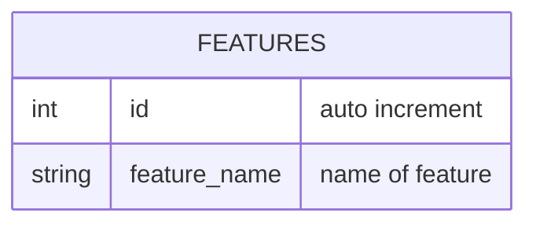

# TABLE feature v1.0.0

---

## Table Schema

| Column name    | type    | Length | Constraints | Nullable | Remark         |
| -------------- | ------- | ------ | ----------- | -------- | -------------- |
| `id`           | INT     |        | PRIMARY KEY |          | AUTO_INCREMENT |
| `feature_name` | VARCHAR | 32     |             | N        |                |

## Simple Value

| Column Name    | Simple                 |
| -------------- | ---------------------- |
| `id`           | 1                      |
| `feature_name` | Create Click Bait Word |
