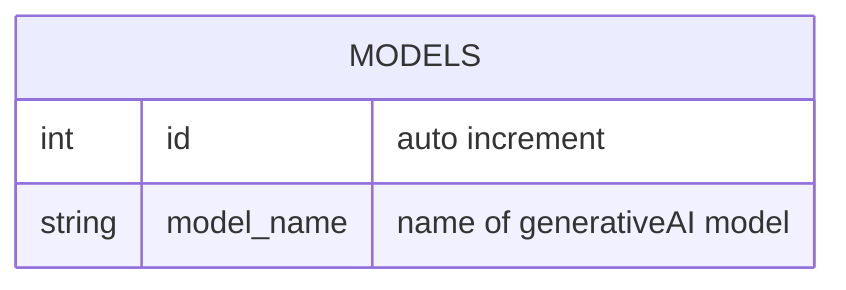

# TABLE model v1.0.0

---

## Table Schema

| Column name  | type    | Length | Constraints | Nullable | Remark         |
| ------------ | ------- | ------ | ----------- | -------- | -------------- |
| `id`         | INT     |        | PRIMARY KEY |          | AUTO_INCREMENT |
| `model_name` | VARCHAR | 16     |             | N        |                |

## Simple Value

| Column Name  | Simple |
| ------------ | ------ |
| `id`         | 1      |
| `model_name` | vertex |
