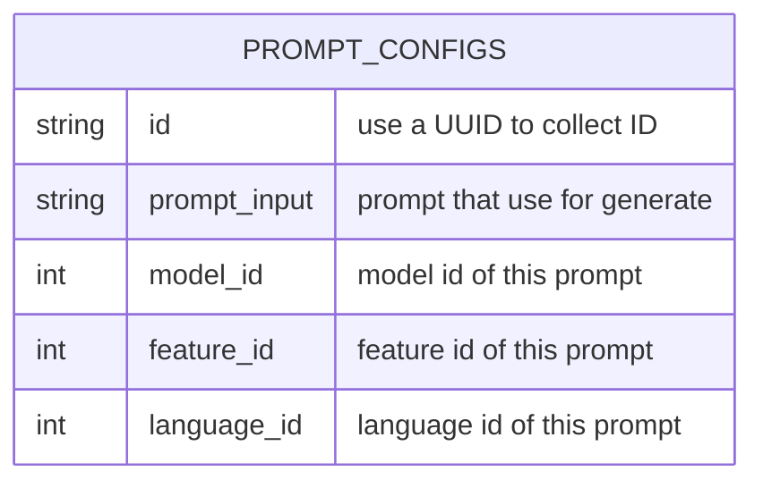

# TABLE prompt_config v1.0.0

---

## Table Schema

| Column name    | type    | Length | Constraints | Nullable | Remark                           |
| -------------- | ------- | ------ | ----------- | -------- | -------------------------------- |
| `id`           | VARCHAR | 36     | PRIMARY KEY |          | UUID                             |
| `prompt_input` | VARCHAR | 255    |             | N        |                                  |
| `model_id`     | INT     |        | FOREING KEY | N        | Modle ID of the prompt_config    |
| `feature_id`   | INT     |        | FOREING KEY | N        | Feature ID of the prompt_config  |
| `language_id`  | INT     |        | FOREING KEY | N        | Language ID of the prompt_config |

## Simple Value

| Column Name   | Simple                                                                                                                                          |
| ------------- | ----------------------------------------------------------------------------------------------------------------------------------------------- |
| `id`          | 9b7f4f56-384d-47f8-bf69-e5508f7f0c4e                                                                                                            |
| `c`           | Write a social media announcement about [{input}] with hashtags and emojis The feeling of the message should be [{type}]. [เป็นภาษาไทยเท่านั้น] |
| `model_id`    | 1                                                                                                                                               |
| `feature_id`  | 2                                                                                                                                               |
| `language_id` | 3                                                                                                                                               |
