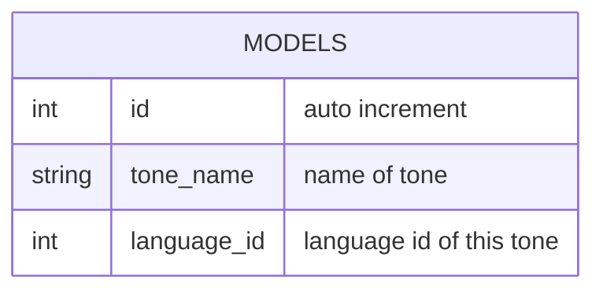

# TABLE tone v1.0.0

---

## Table Schema

| Column name   | type    | Length | Constraints | Nullable | Remark              |
| ------------- | ------- | ------ | ----------- | -------- | ------------------- |
| `id`          | INT     |        | PRIMARY KEY |          | AUTO_INCREMENT      |
| `tone_name`   | VARCHAR | 16     |             | N        |                     |
| `language_id` | INT     |        | FOREING KEY | N        | Language ID of tone |

## Simple Value

| Column Name   | Simple    |
| ------------- | --------- |
| `id`          | 1         |
| `tone_name`   | Confident |
| `language_id` | 3         |
