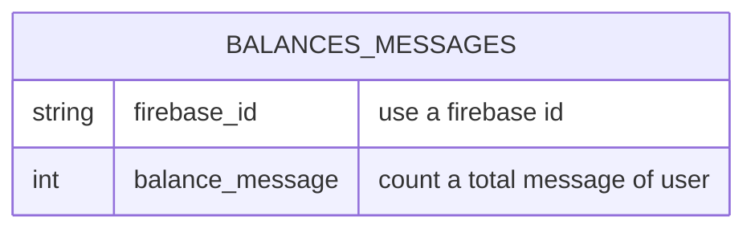

# TABLE balance_messages v1.0.0

---

## Table Schema
| Column name       | type    | Length | Constraints | Nullable | Remark       |
| ----------------- | ------- | ------ | ----------- | -------- | ------------ |
| `firebase_id`     | VARCHAR | 50     | PRIMARY KEY | N        | Firebase UID |
| `balance_message` | INT     |        |             | N        |              |

## Simple Value
| Column Name       | Simple           |
| ----------------- | ---------------- |
| `firebase_id`     | ihias92343g1rh42 |
| `balance_message` | 999              |
