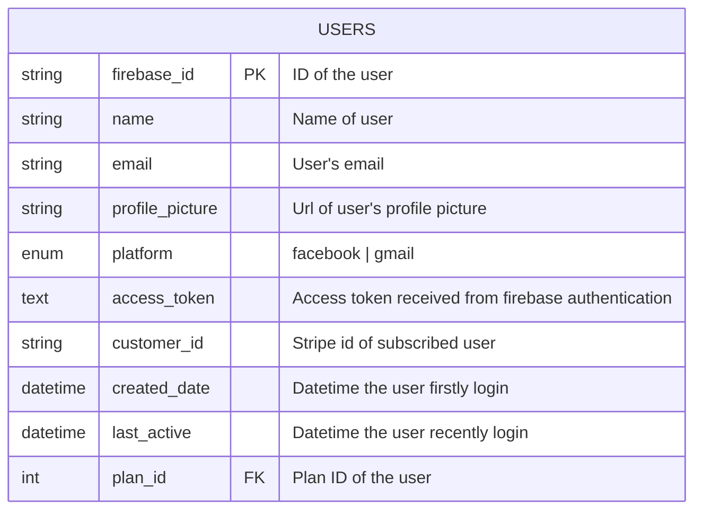

# TABLE users v1.0.0

---

## Table Schema
| Column name       | type    | Length | Constraints | Nullable | Remark       |
| ----------------- | ------- | ------ | ----------- | -------- | ------------ |
| `firebase_id`     | VARCHAR | 50     | PRIMARY KEY |         | Firebase UID |
| `name` | VARCHAR    | 255        |             | N        |      Name of user       | 
| `email` | VARCHAR    | 50        |             | N        |      Name of user       | 
| `profile_picture` | TEXT    |         |             | N        |      User's email       | 
| `platform` | ENUM    |         |             |         |      facebook or gmail       | 
| `access_token` | TEXT    |         |             |  N       |      Access token received from firebase authentication       | 
| `customer_id` | VARCHAR    |   36      |             |     N    |      Stripe id of subscribed user       | 
| `created_date` | DATETIME    |         |             |         |      Datetime the user firstly login       | 
| `last_active` | DATETIME    |         |             |         |      Datetime the user recently login      | 
| `plan_id` | INT    |         |   Foreign Key          |     N    |      Plan ID of the user      | 

## Simple Value
| Column Name     | Simple |
| --------------- | ------ |
| `firebase_id`   | 3xf49S9a8bN1Zt2kjPx      |
| `name` | John Doe     |
| `email`   | example01@gmail.com       |
| `profile_picture` |   https://avatar.iran.liara.run/public/25            |
| `platform`    | facebook  |
| `access_token` |   E0979758668OsDJeiz....       |
| `customer_id` |    cus_946716AtojFCY0       |
| `created_date` |    2024-05-22T12:53:24+00:00       |
| `last_active` |    2024-05-22T12:53:24+00:00       |
| `plan_id`     | 4         |

