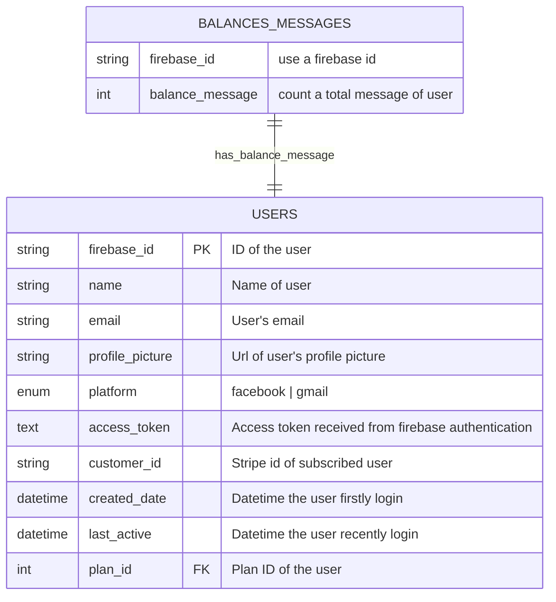

## Balance messages DB

```mermaid
    erDiagram
    BALANCES_MESSAGES ||--|| USERS : has_balance_message
    BALANCES_MESSAGES{
        string firebase_id "use a firebase id"
        int balance_message "count a total message of user"
    }

    USERS {
        string firebase_id PK "ID of the user"
        string name "Name of user"
        string email "User's email"
        string profile_picture "Url of user's profile picture"
        enum platform "facebook | gmail"
        text access_token "Access token received from firebase authentication"
        string customer_id "Stripe id of subscribed user"
        datetime created_date   "Datetime the user firstly login"
        datetime last_active "Datetime the user recently login"
        int plan_id FK "Plan ID of the user"
    }
```

### Description
* 1 User must have only 1 balance messages data.