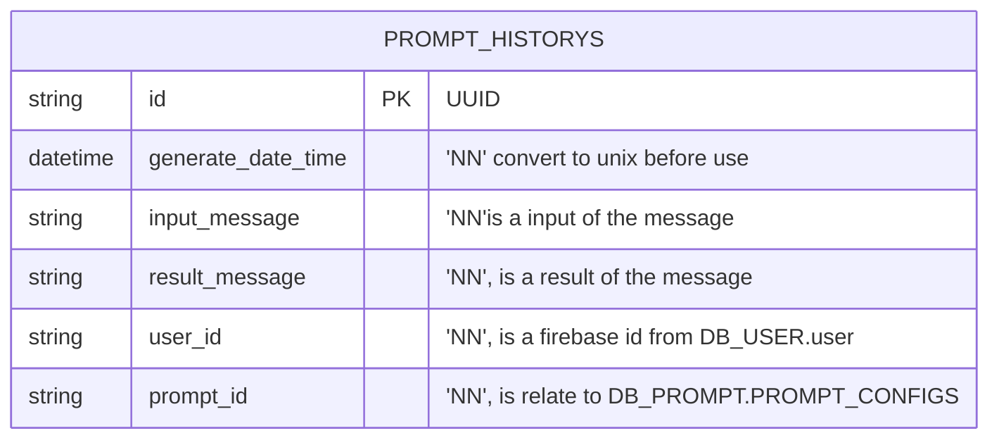
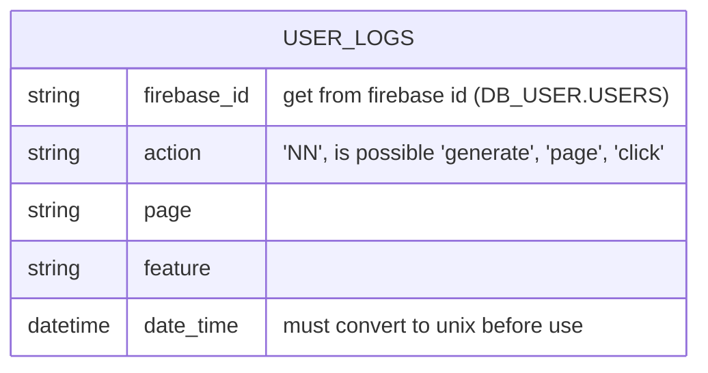

# PromptHistroy DB

```mermaid
erDiagram
    PROMPT_HISTORYS{
        string id PK "UUID"
        datetime generate_date_time "'NN' convert to unix before use"
        string input_message "'NN'is a input of the message"
        string result_message "'NN', is a result of the message"
        string user_id "'NN', is a firebase id from DB_USER.user"
        string prompt_id "'NN', is relate to DB_PROMPT.PROMPT_CONFIGS"
    }


```

```mermaid
erDiagram
    USER_LOGS{
        string firebase_id "get from firebase id (DB_USER.USERS)"
        string action "'NN', is possible 'generate', 'page', 'click'"
        string page
        string feature
        datetime date_time "must convert to unix before use"
    }
```