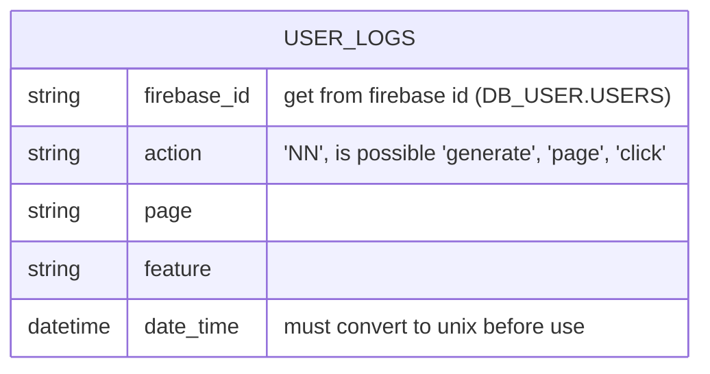

# Logs

```mermaid
erDiagram
    USER_LOGS{
        string firebase_id "get from firebase id (DB_USER.USERS)"
        string action "'NN', is possible 'generate', 'page', 'click'"
        string page
        string feature
        datetime date_time "must convert to unix before use"
    }
```