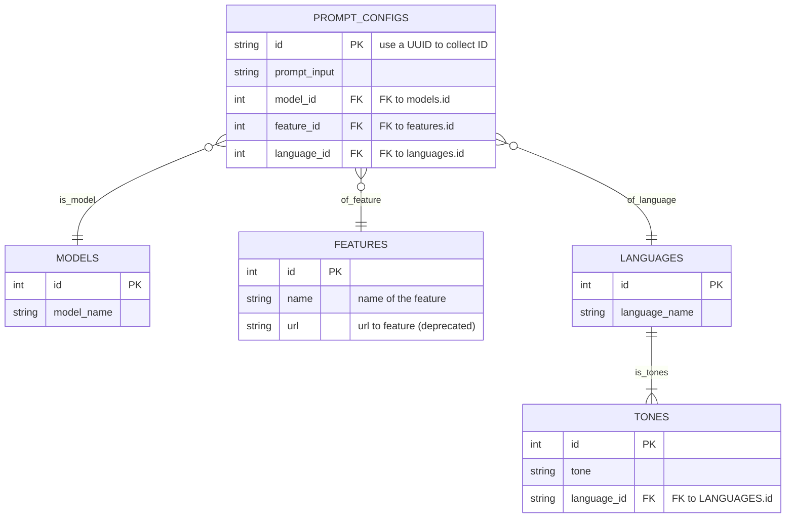

## Prompt DB

```mermaid
erDiagram
    PROMPT_CONFIGS }o--|| MODELS: is_model
    PROMPT_CONFIGS{
        string id PK "use a UUID to collect ID"
        string prompt_input 
        int model_id FK "FK to models.id"
        int feature_id FK "FK to features.id"
        int language_id FK "FK to languages.id"
    }
    MODELS{
        int id PK
        string model_name
    }
    PROMPT_CONFIGS }o--|| FEATURES: of_feature
    FEATURES{
        int id PK
        string name "name of the feature" 
        string url "url to feature (deprecated)"
    }
    PROMPT_CONFIGS }o--|| LANGUAGES: of_language
    LANGUAGES{
        int id PK
        string language_name
    }

    LANGUAGES ||--|{ TONES: is_tones
    TONES{
        int id PK 
        string tone 
        string language_id FK "FK to LANGUAGES.id"
    }
    
```
