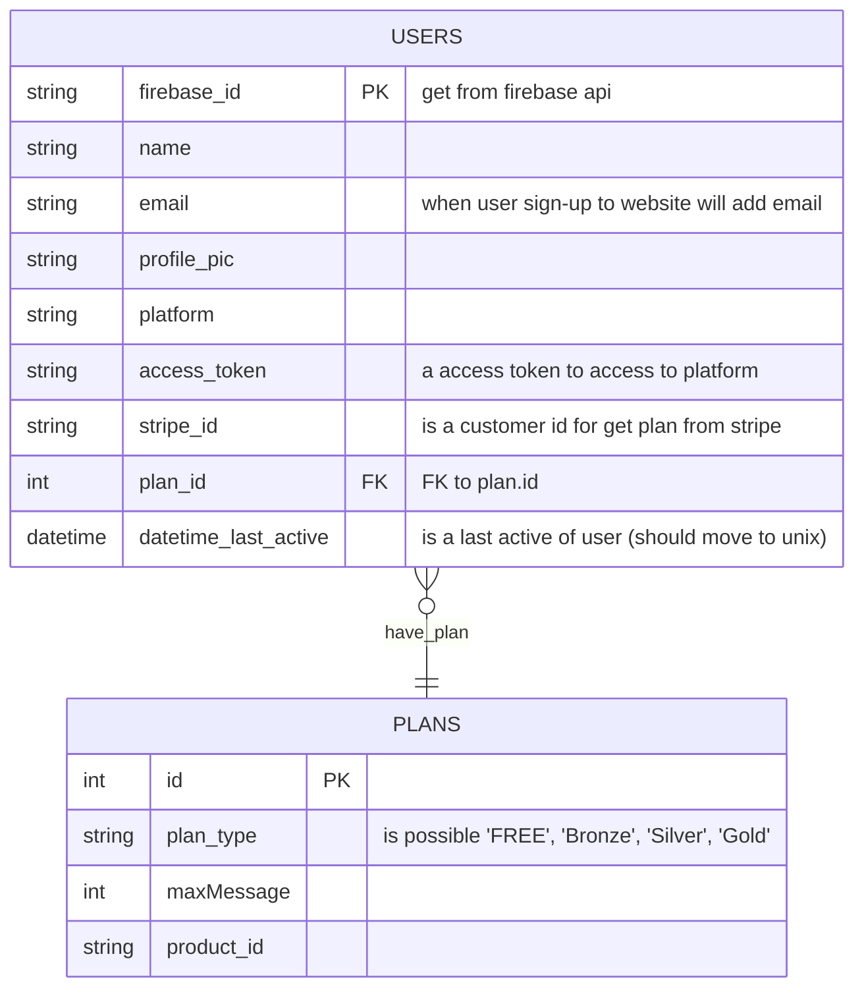

## User DB

```mermaid
    erDiagram
    USERS }o--|| PLANS : have_plan
    USERS {
        string firebase_id PK "get from firebase api"
        string name 
        string email "when user sign-up to website will add email"
        string profile_pic
        string platform
        string access_token "a access token to access to platform"
        string stripe_id "is a customer id for get plan from stripe"
        int plan_id FK "FK to plan.id"
        datetime datetime_last_active "is a last active of user (should move to unix)"
    }
    PLANS{
        int id PK 
        string plan_type "is possible 'FREE', 'Bronze', 'Silver', 'Gold'"
        int maxMessage 
        string product_id 
    }
```
