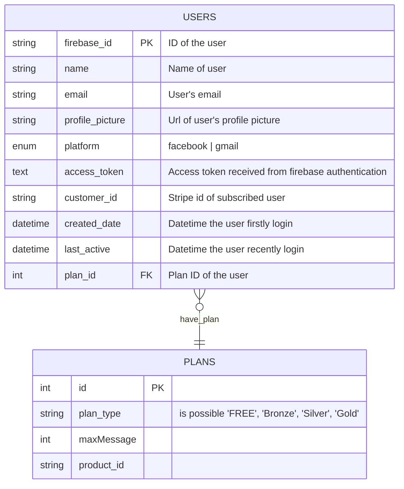

## User DB

```mermaid
    erDiagram
    USERS }o--|| PLANS : have_plan
    USERS {

        string firebase_id PK "ID of the user"
        string name "Name of user"
        string email "User's email"
        string profile_picture "Url of user's profile picture"
        enum platform "facebook | gmail"
        text access_token "Access token received from firebase authentication"
        string customer_id "Stripe id of subscribed user"
        datetime created_date   "Datetime the user firstly login"
        datetime last_active "Datetime the user recently login"
        int plan_id FK "Plan ID of the user"
    }
    PLANS{
        int id PK 
        string plan_type "is possible 'FREE', 'Bronze', 'Silver', 'Gold'"
        int maxMessage 
        string product_id 
    }
```
