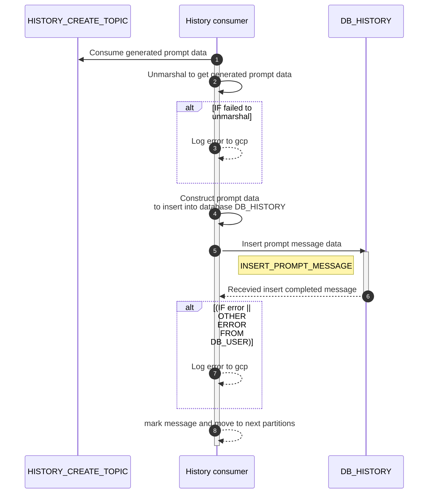

# POST api/v1/history-cosumer/save-message


| Name                     | Detail                                                              |
| ------------------------ | ------------------------------------------------------------------- |
| **Overview**             | Consume completely generated message and save into database |
| **Layer**                | `Core`                                                              |
| **Microservice**         | `history-consumer`                                                         |
| **Related to Service**   | `DB_HISTORY`                                                           |
| **Authentication Level** | `None`                                                              |


## Sequential Diagram

### SQL command
`INSERT_PROMPT_MESSAGE`
```SQL
INSERT INTO prompt_histories
(id, created_date, input_message, result_message, firebase_id, prompt_id, tone_id)
VALUES ({:id}, {:createdDate}, {:inputMessage}, {:resultMessage}, {:firebaseId}, {:promptId}, {:toneId})
```

### Change Log
| Date       | Update By                              | Description     |
| ---------- | -------------------------------------- | --------------- |
| 2024-03-30 | [@thanawut](https://github.com/HanawuZ) | initial Project |
| 2024-05-25 | [@thanawut](https://github.com/HanawuZ) | refactor application design |

## Request
### Request Schema
Data consume from Kafka topic `HISTORY_CREATE_TOPIC`

| Field            | location  | Type      | Mandatory(Man/Opt/Cond)   | Target    | Description                       |
| ------------     | --------  | ------    | -----------------------   | ------    | --------------------------------- |
| `inputMessage`     | body      | string    | M                         | -         | a input of the message                                 |
| `resultMessage`   | body      | string    | O                         | -         |  a result of the message                                 |
| `firebaseId`          | body      | string       | M                         | -         | a firebase id from `DB_USER.users`                                 |
| `promptId`          | body      | string       | M                         | -         | relate to `DB_PROMPT.PROMPT_CONFIGS`. It should be UUID                                 |
| `toneId`          | body      | string       | M                         | -         | relate to tone of prompt                                 |

### Sample Request
```json
{
    "inputMessage": "Iphone11",
    "resultMessage": "Iphone 11 is the best iphone in the world #iphone11 #bestiphone",
    "firebaseId": "3xf49S9a8bN1Zt2kjPx",
    "promptId":"018f42bb-cc9d-7023-b916-b13131b8c261",
    "toneId":"1"
}
```

## Response
### Response Schema
```json
`None`
```
## Field to Field Mapping 

### Field mapping when insert [DB_HISTORY TABLE prompt_histories]()
| Target Field Name       | Location | Tranformation | Mandatory | Source                                               | Remark |
| ----------------------- | -------- | ------------- | --------- | ---------------------------------------------------- | ------ |
| `data`.`id`     |          | Create from service        | M         | [DB_USER TABLE prompt_histories]().`id`     |        |
| `data`.`createdDate`     |          | Create from service        | M         | [DB_USER TABLE prompt_histories]().`created_date`     |        |
| `data`.`inputMessage`     |          | Direct        | M         | [DB_USER TABLE prompt_histories]().`input_message`     |        |
| `data`.`resultMessage`     |          | Direct        | M         | [DB_USER TABLE prompt_histories]().`result_message`     |        |
| `data`.`firebaseId`     |          | Direct        | M         | [DB_USER TABLE prompt_histories]().`firebase_id`     |        |
| `data`.`promptId`     |          | Direct        | M         | [DB_USER TABLE prompt_histories]().`prompt_id`     |        |
| `data`.`toneId`     |          | Direct        | M         | [DB_USER TABLE prompt_histories]().`tone_id`     |        |