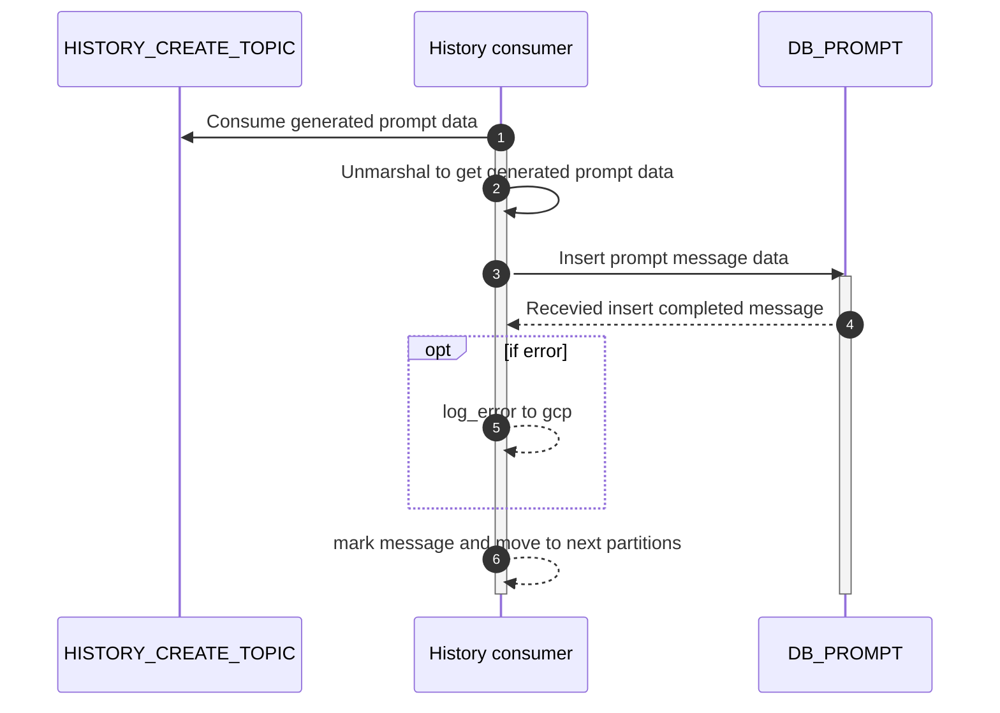

# POST api/v1/historyConsumer/saveMessaage

## Sequential Diagram


## Request
### Request Schema
Data consume from Kafka topic `HISTORY_CREATE_TOPIC`

| Field            | location  | Type      | Mandatory(Man/Opt/Cond)   | Target    | Description                       |
| ------------     | --------  | ------    | -----------------------   | ------    | --------------------------------- |
| inputMessage     | body      | string    | -                         | -         | -                                 |
| resultMessage    | body      | string    | -                         | -         | -                                 |
| userId           | body      | int        | -                         | -         | -                                 |
| toneId           | body      | int       | -                         | -         | -                                 |
| featureId        | body      | int       | -                         | -         | -                                 |
| modelId          | body      | int       | -                         | -         | -                                 |

### Sample Request
```json
{
    "inputMessage": "Iphone11",
    "resultMessage": "Iphone 11 is the best iphone in the world #iphone11 #bestiphone",
    "userId" : 1,
    "toneId" : 1,
    "featureId" : 1,
    "modelId" : 1
}
```