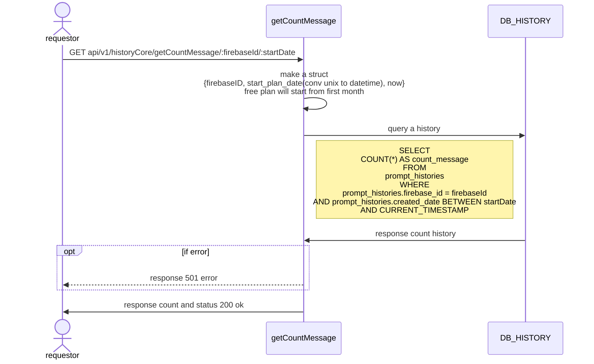

# GET api/v1/historyCore/getCountMessage/:firebaseId/:startDate

## Sequential Diagram



## Request Body

### Request Schema

| Field      | location | Type   | Mandatory(Man/Opt/Cond) | Target | Description |
| ---------- | -------- | ------ | ----------------------- | ------ | ----------- |
| firebaseId | param    | string | M                       | -      | -           |
| startDate  | param    | int64  | M                       | -      | -           |

### Sample Request

```json
{
  "firebaseId": "string",
  "startDate": 1712162101,
}
```

## Response Body

### Response Schema

| Field        | location | Type   | Mandatory(Man/Opt/Cond) | Target | Description |
| ------------ | -------- | ------ | ----------------------- | ------ | ----------- |
| messageCount | body     | int | M                       | -      | -           |

### Sample Response

```json
{
  "messageCount": 59
}
```

