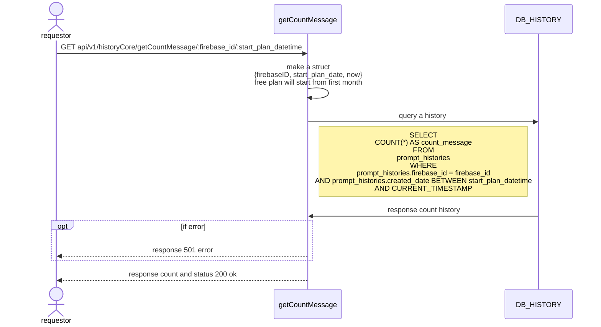

# GET api/v1/historyCore/getCountMessage/:firebase_id/:start_plan_datetime

## Sequential Diagram

```mermaid
sequenceDiagram
    actor req as requestor
    participant countService as getCountMessage
    participant hist as DB_HISTORY

    req ->> countService: GET api/v1/historyCore/getCountMessage/:firebase_id/:start_plan_datetime

    countService ->> countService: make a struct <br/> {firebaseID, start_plan_date, now} <br/>free plan will start from first month

    countService ->> hist: query a history
    note right of countService: SELECT<br/>	COUNT(*) AS count_message<br/>FROM<br/>	prompt_histories<br/>WHERE<br/>	prompt_histories.firebase_id = firebase_id<br/>	AND prompt_histories.created_date BETWEEN start_plan_datetime<br/>	AND CURRENT_TIMESTAMP;

    hist ->> countService : response count history 

    opt if error
    countService -->> req: response 501 error
    end

     countService -->> req: response count and status 200 ok

```

