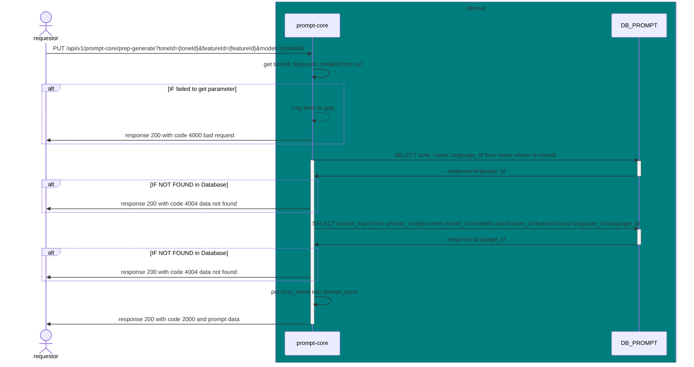

# GET /api/v1/prompt-core/prep-generate?toneId={toneId}&featureId={featureId}&model={modelId}

| Name                     | Detail                                                                         |
| ------------------------ | ------------------------------------------------------------------------------ |
| **Overview**             | inquiry a prompt when user click generate before orch use this to generate msg |
| **Layer**                | `Core`                                                                         |
| **Microservice**         | `prompt-core`                                                                  |
| **Related to Service**   | `DB_PROMPT`                                                                    |
| **Authentication Level** | `None`                                                                         |

## Change Log

| Date       | Update By                             | Description     |
| ---------- | ------------------------------------- | --------------- |
| 2024-05-27 | [@sirin](https://github.com/aamjazrk) | initial Project |



## Request

### Header

| Field Name     | Location | Type   | Mandatory (M/O/C) | Source | Description        |
| -------------- | -------- | ------ | ----------------- | ------ | ------------------ |
| `x-request-id` | HEADER   | string | M                 |        | generate from orch |

### Request Schema

### Sample Request

```json
`None`
```

## Response

### Response Schema

| Field Name | type   | Mandatory (M/O/C) | target | Description       |
| ---------- | ------ | ----------------- | ------ | ----------------- |
| `status`   | int    | M                 |        |                   |
| `code`     | int    | M                 |        |                   |
| `message`  | string | O                 |        | message for error |

### Sample Response

#### When get prompt is completed

```json
{
  "status": 200,
  "code": 2000,
  "message": {
    "prompt": "write full scripts for short video that talk about [ {input}] and the feeling of scripts is [มีการศึกษา] [เป็นภาษาไทยเท่านั้น]"
  }
}
```

#### When get data from database is failed

```json
{
  "status": 200,
  "code": 4004,
  "message": "data not found"
}
```

#### When get toneId, featureId, modelId from url is failed

```json
{
  "status": 200,
  "code": 4000,
  "message": "bad request"
}
## Field to Field Mapping

### Field mapping when Inquiry [DB_PROMPT TABLE prompt_configs](https://github.com/promptlabth/docs-of-all/blob/main/database/PROMPT/prompt_config.md)

| Target Field Name     | Location | Tranformation | Mandatory | Source                                                                                                                                 | Remark |
| --------------------- | -------- | ------------- | --------- | -------------------------------------------------------------------------------------------------------------------------------------- | ------ |
| `data`.`id`           |          | Direct        | M         | [DB_PROMPT TABLE prompt_configs](https://github.com/promptlabth/docs-of-all/blob/main/database/PROMPT/prompt_config.md).`id`           |        |
| `data`.`prompt_input` |          | Direct        | M         | [DB_PROMPT TABLE prompt_configs](https://github.com/promptlabth/docs-of-all/blob/main/database/PROMPT/prompt_config.md).`prompt_input` |        |
| `data`.`model_id`     |          | Direct        | M         | [DB_PROMPT TABLE prompt_configs](https://github.com/promptlabth/docs-of-all/blob/main/database/PROMPT/prompt_config.md).`model_id`     |        |
| `data`.`feature_id`   |          | Direct        | M         | [DB_PROMPT TABLE prompt_configs](https://github.com/promptlabth/docs-of-all/blob/main/database/PROMPT/prompt_config.md).`feature_id`   |        |
| `data`.`language_id`  |          | Direct        | M         | [DB_PROMPT TABLE prompt_configs](https://github.com/promptlabth/docs-of-all/blob/main/database/PROMPT/prompt_config.md).`language_id`  |        |

## Dicussing

- จะให้เส้นนี้เป็นคน map โทนลงไปใน prompt หรือ orch เป็น map
- จะใช้ join เพื่อแตะ db ครั้งเดียวหรือ inquiry แยก table
