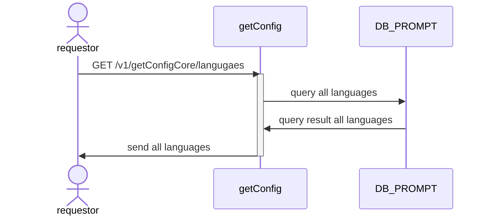

# GET api/v1/promptCore/getConfigCore/languages

## Sequential Diagram


## Request Body
`None`

### Response
```
[
    {
        "id": 1
        "name": "th"
    },
    {
        "id": 2
        "name": "en"
    },
    {
        "id": 3
        "name": "id"
    },
]
```
