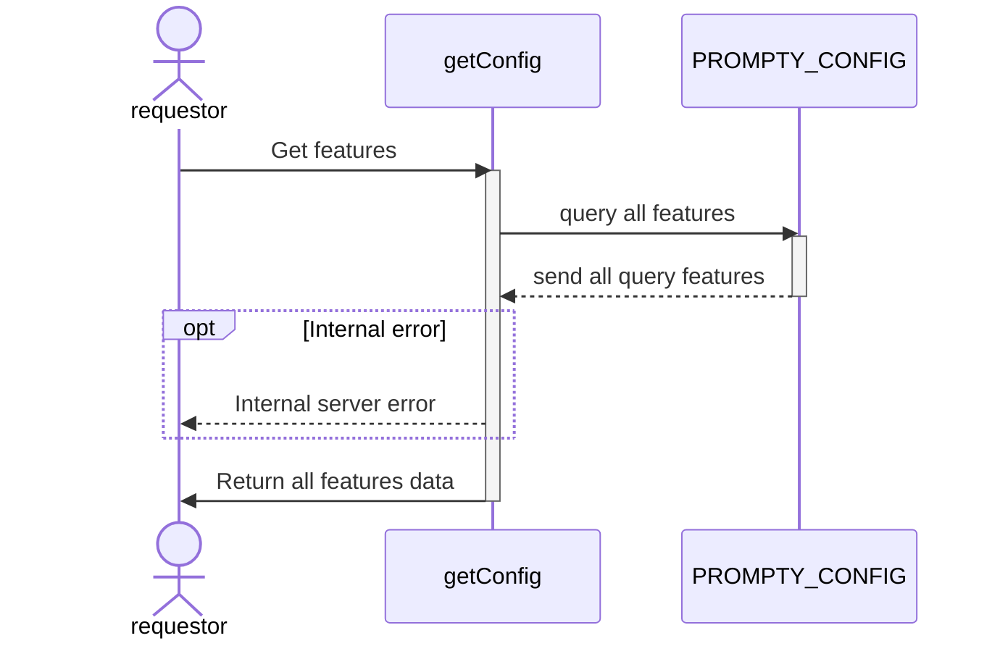

# GET /api/v1/prompt-core/features

| Name                     | Detail                                  |
| ------------------------ | --------------------------------------- |
| **Overview**             | inquiry all features in database |
| **Layer**                | `CORE`, `DOMAIN`                        |
| **Microservice**         | `ms-prompt-core`                        |
| **Related to Service**   | `get-config-orch`                       |
| **Authentication Level** | `None`                                  |

### Change Log
| Date       | Update By                              | Description     |
| ---------- | -------------------------------------- | --------------- |
| 2024-06-06 | [@thanawut](https://github.com/HanawuZ) | initial Project |


---


## Request
### Request Schema
`None`

### Sample Request 
`None`

## Response
### Response Schema
| Field Name                       | Type   | Mandatory(M/O/C) | Source | Description |
| -------------------------------- | ------ | ---------------- | ------ | ----------- |
| `status`                         | int    | M                |        |             |
| `code`                           | int    | M                |        |             |
| `data`.`features[]`              | array  | M                |        |             |
| `data`.`features[].id`           | int    | M                |        |             |
| `data`.`features[].name`         | string | M                |        |             |
| `data`.`features[].url`          | string | M                |        |             |

### Sample Response 
``` json
{
    "status": 200,
    "code": 2000,
    "data": {
        "features" : [
            {
                "id": 1,
                "name": "คิดแคปชั่นขายของ",
                "url":"https://promptlabai.com/createSellingPost"
            },
            {
                "id": 2,
                "name": "ช่วยคิดคอนเทนต์",
                "url":"https://promptlabai.com/createIdeaContent"
            },
            // Other feature data......
            // Other feature data......
        ]
    }
}
```
