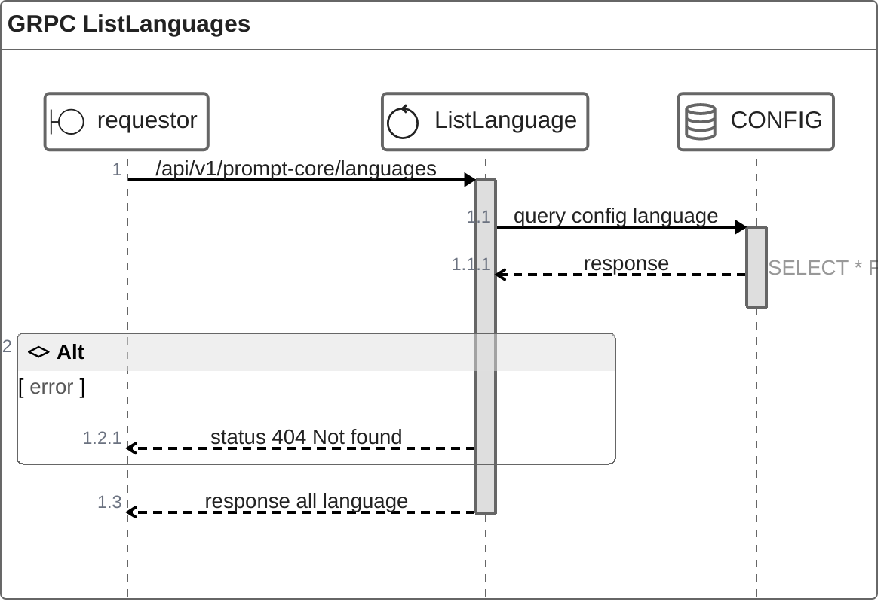

# GET /api/v1/prompt-core/languages

| Name                     | Detail                                  |
| ------------------------ | --------------------------------------- |
| **Overview**             | inquiry all language config in database |
| **Layer**                | `CORE`, `DOMAIN`                        |
| **Microservice**         | `ms-prompt-core`                        |
| **Related to Service**   | `get-config-orch`                       |
| **Authentication Level** | `None`                                  |


### Change Log
| Date       | Update By                              | Description     |
| ---------- | -------------------------------------- | --------------- |
| 2024-05-06 | [@tanachod](https://github.com/Pet002) | initial Project |

---

---

## Request
### Request Schema
`None`

### Sample Request 
``` json
{

}
```

## Response
### Response Schema
| Field Name                       | Type   | Mandatory(M/O/C) | Source | Description |
| -------------------------------- | ------ | ---------------- | ------ | ----------- |
| `status`                         | int    | M                |        |             |
| `code`                           | int    | M                |        |             |
| `data`.`language[]`              | array  | M                |        |             |
| `data`.`language[].id`           | int    | M                |        |             |
| `data`.`language[].languageName` | string | M                |        |             |


### Sample Response 
``` json
{
    "status": 200,
    "code": 2000,
    "data": {
        "languages" : [
            {
                "id": 1,
                "languageName": "th"
            },
             {
                "id": 2,
                "languageName": "eng"
            }
        ]
    }
}
```

## Field to Field Mappign
### Field mapping when call [Table languages]()
| Target Field Name         | Location | Tranformation | Mandatory (M/O/C) | Source Field                       | Remark |
| ------------------------- | -------- | ------------- | ----------------- | ---------------------------------- | ------ |
| `language[].id`           |          | Direct        | M                 | [Table languages]().`id`           |        |
| `language[].languageName` |          | Direct        | M                 | [Table languages]().`languageName` |        |
