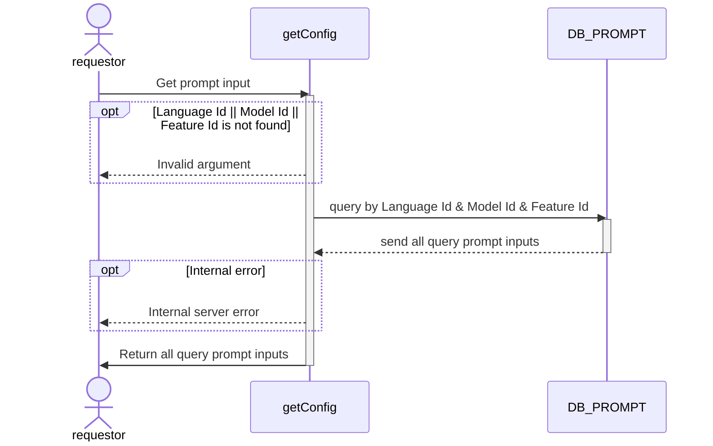

# 

## Sequential Diagram


## Request Body

### Request Schema

| Field      | location | Type   | Mandatory(Man/Opt/Cond) | Target | Description |
| ---------- | -------- | ------ | ----------------------- | ------ | ----------- |
| languageId | param    | int64 | M                       | -      | -           |
| modelId  | param    | int64  | M                       | -      | -           |
| featureId  | param    | int64  | M                       | -      | -           |


### Sample Request

```json
{
  "languageId": 1,
  "modelId": 1,
  "featureId": 1,
}
```

## Response Body

### Response Schema

| Field        | location | Type   | Mandatory(Man/Opt/Cond) | Target | Description |
| ------------ | -------- | ------ | ----------------------- | ------ | ----------- |
| id | body     | string | M                       | -      | -           |
| promptInput | body     | string | M                       | -      | -           |

### Sample Response

```json
{
    "id":"555a6f50-c7d0-4027-aac4-5489ceb4f174",
    "promptInput": "Write a social media announcement about [{input}] with hashtags and emojis The feeling of the message should be [{type}]. [เป็นภาษาไทยเท่านั้น]",
}
```
