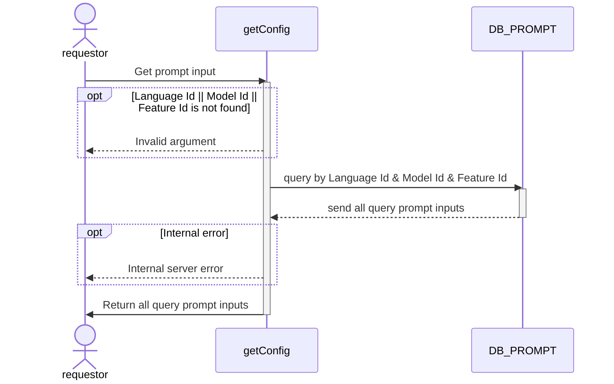

# 

## Sequential Diagram

```mermaid
sequenceDiagram
    actor req as requestor
    participant getConfig
    participant prompt as DB_PROMPT

    req ->> getConfig : Get prompt input
    activate getConfig
    opt Language Id || Model Id || Feature Id is not found
        getConfig -->> req: Invalid argument
    end
    getConfig ->> prompt : query by Language Id & Model Id & Feature Id
    activate prompt
    prompt -->> getConfig : send all query prompt inputs
    deactivate prompt
    opt Internal error
        getConfig -->> req: Internal server error
    end 
    getConfig ->> req: Return all query prompt inputs
    deactivate getConfig

```