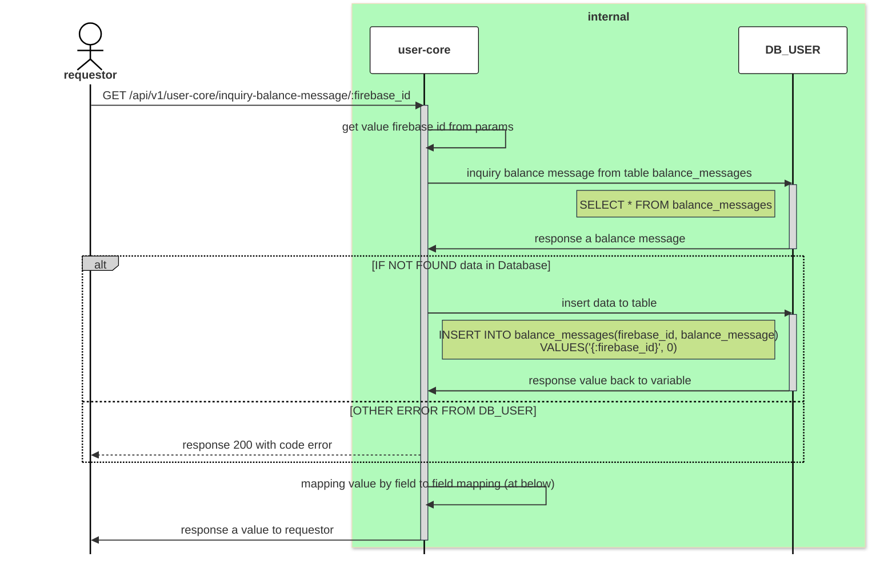

# GET /api/v1/user-core/inquiry-balance-message/:firebase_id

| Name                     | Detail                                                              |
| ------------------------ | ------------------------------------------------------------------- |
| **Overview**             | inquiry a account of user when `landing` and `login` to promptlabai |
| **Layer**                | `Core`                                                              |
| **Microservice**         | `user-core`                                                         |
| **Related to Service**   | `DB_USER`                                                           |
| **Authentication Level** | `None`                                                              |

### Change Log
| Date       | Update By                              | Description     |
| ---------- | -------------------------------------- | --------------- |
| 2024-05-20 | [@tanachod](https://github.com/Pet002) | initial Project |



## Request
### Header 
| Field Name     | Location | Type   | Mandatory (M/O/C) | Source | Description        |
| -------------- | -------- | ------ | ----------------- | ------ | ------------------ |
| `x-request-id` | HEADER   | string | M                 |        | generate from orch |

### Request Schema
| Field Name    | Location | Type   | Mandatory (M/O/C) | Source | Description |
| ------------- | -------- | ------ | ----------------- | ------ | ----------- |
| `firebase_id` | Param    | string | M                 |        |             |

### Sample Request
```json
`None`
```

## Response
### Response Schema
| Field Name              | type   | Mandatory (M/O/C) | target | Description       |
| ----------------------- | ------ | ----------------- | ------ | ----------------- |
| `status`                | int    | M                 |        |                   |
| `code`                  | int    | M                 |        |                   |
| `data`                  | object | O                 |        |                   |
| `data`.`firebaseId`     | string | M                 |        |                   |
| `data`.`balanceMessage` | int    | M                 |        |                   |
| `message`               | string | O                 |        | message for error |

### Sample Response 
```json
{
    "status": 200,
    "code": 2000,
    "data": {
        "firebaseId" : "if9012fds0asd",
        "balanceMessage": 999999999
    }
}
```
## Field to Field Mapping 

### Field mapping when Inquiry and Insert [DB_USER TABLE balance_messages]()
| Target Field Name       | Location | Tranformation | Mandatory | Source                                               | Remark |
| ----------------------- | -------- | ------------- | --------- | ---------------------------------------------------- | ------ |
| `data`.`firebaseId`     |          | Direct        | M         | [DB_USER TABLE balance_messages]().`firebase_id`     |        |
| `data`.`balanceMessage` |          | Direct        | M         | [DB_USER TABLE balance_messages]().`balance_message` |        |