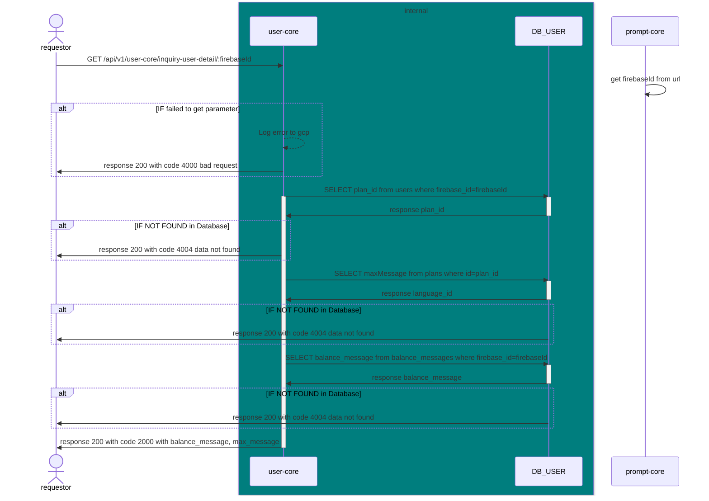

# GET /api/v1/user-core/inquiry-user-detail/:firebaseId

| Name                     | Detail                                                                         |
| ------------------------ | ------------------------------------------------------------------------------ |
| **Overview**             | inquiry a prompt when user click generate before orch use this to generate msg |
| **Layer**                | `Core`                                                                         |
| **Microservice**         | `user-core`                                                                    |
| **Related to Service**   | `DB_USER`                                                                      |
| **Authentication Level** | `None`                                                                         |

## Change Log

| Date       | Update By                             | Description     |
| ---------- | ------------------------------------- | --------------- |
| 2024-05-27 | [@sirin](https://github.com/aamjazrk) | initial Project |



## Request

### Header

| Field Name     | Location | Type   | Mandatory (M/O/C) | Source | Description        |
| -------------- | -------- | ------ | ----------------- | ------ | ------------------ |
| `x-request-id` | HEADER   | string | M                 |        | generate from orch |

### Request Schema

### Sample Request

```json
`None`
```

## Response

### Response Schema

| Field Name | type   | Mandatory (M/O/C) | target | Description       |
| ---------- | ------ | ----------------- | ------ | ----------------- |
| `status`   | int    | M                 |        |                   |
| `code`     | int    | M                 |        |                   |
| `message`  | string | O                 |        | message for error |

### Sample Response

#### When get prompt is completed

```json
{
  "status": 200,
  "code": 2000,
  "message": {
    "balance_message": 40,
    "max_message": 30
  }
}
```

#### When get data from database is failed

```json
{
  "status": 200,
  "code": 4004,
  "message": "data not found"
}
```

#### When get firebaseId from url is failed

```json
{
  "status": 200,
  "code": 4000,
  "message": "bad request"
}
```

## Field to Field Mapping

### Field mapping when Inquiry [DB_USER TABLE users]()

| Target Field Name        | Location | Tranformation | Mandatory | Source                                    | Remark |
| ------------------------ | -------- | ------------- | --------- | ----------------------------------------- | ------ |
| `data`.`firebase_id`     |          | Direct        | M         | [DB_USER TABLE users]().`firebase_id`     |        |
| `data`.`name`            |          | Direct        | M         | [DB_USER TABLE users]().`name`            |        |
| `data`.`email`           |          | Direct        | M         | [DB_USER TABLE users]().`email`           |        |
| `data`.`profile_picture` |          | Direct        | M         | [DB_USER TABLE users]().`profile_picture` |        |
| `data`.`access_token`    |          | Direct        | M         | [DB_USER TABLE users]().`access_token`    |        |
| `data`.`customer_id`     |          | Direct        | M         | [DB_USER TABLE users]().`customer_id`     |        |
| `data`.`created_date`    |          | Direct        | M         | [DB_USER TABLE users]().`created_date`    |        |
| `data`.`last_active`     |          | Direct        | M         | [DB_USER TABLE users]().`last_active`     |        |
| `data`.`plan_id`         |          | Direct        | M         | [DB_USER TABLE users]().`plan_id`         |        |

### Field mapping when Inquiry [DB_USER TABLE balance_messages]()

| Target Field Name        | Location | Tranformation | Mandatory | Source                                               | Remark |
| ------------------------ | -------- | ------------- | --------- | ---------------------------------------------------- | ------ |
| `data`.`firebase_id`     |          | Direct        | M         | [DB_USER TABLE balance_messages]().`firebase_id`     |        |
| `data`.`balance_message` |          | Direct        | M         | [DB_USER TABLE balance_messages]().`balance_message` |        |


## Dicussing

- response ส่งเป็น flag ว่า gen เพิ่มได้มั้ย หรือว่าส่งเป็นค่าแล้ว orch ไปเช็คเอง
- จะใช้ join เพื่อแตะ db ครั้งเดียวหรือ inquiry แยก table
