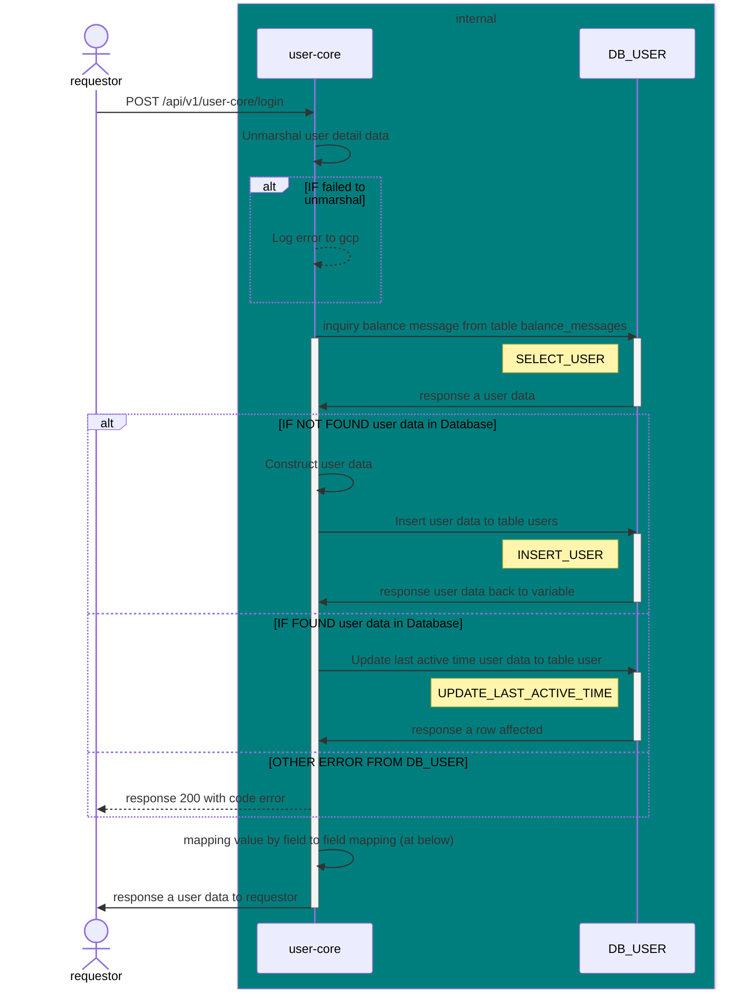

# POST /api/v1/user-core/login

| Name                     | Detail                                                              |
| ------------------------ | ------------------------------------------------------------------- |
| **Overview**             | update count of balance message when generating message is completed |
| **Layer**                | `Core`                                                              |
| **Microservice**         | `user-core`                                                         |
| **Related to Service**   | `DB_USER`                                                           |
| **Authentication Level** | `None`                                                              |


### Change Log
| Date       | Update By                              | Description     |
| ---------- | -------------------------------------- | --------------- |
| 2024-05-25 | [@thanawut](https://github.com/HanawuZ) | initial Project |




### SQL command
### SELECT_USER
```SQL
SELECT 
    u.firebase_id,
    u.name, 
    u.email
    u.profile_picture,
    u.platform,
    u.created_date,
    u.last_active,
    p.id as plan_id,
    p.plan_type,
    p.max_message
FROM users u
JOIN plans p ON u.plan_id = p.id
WHERE u.firebase_id = {:firebaseId}
```

#### INSERT_USER
```SQL
INSERT INTO users
(firebase_id, name, email, profile_picture, platform, access_token, customer_id, created_date, last_active, plan_id)
VALUES 
({:firebaseId}, {:name}, {:email}, {:profilePicture}, {:platform}, {:accessToken}, NULL, {:createdDate}, {:lastActive}, {:planId})
```

#### UPDATE_LAST_ACTIVE_TIME
```SQL
UPDATE users SET last_active = {:lastActive} WHERE firebase_id = {:firebaseId}
```

## Request
### Header 
| Field Name     | Location | Type   | Mandatory (M/O/C) | Source | Description        |
| -------------- | -------- | ------ | ----------------- | ------ | ------------------ |
| `x-request-id` | HEADER   | string | M                 |        | generate from orch |

### Request Schema
| Field Name    | Location | Type   | Mandatory (M/O/C) | Source | Description |
| ------------- | -------- | ------ | ----------------- | ------ | ----------- |
| `firebaseId` | Body    | string | M                 |        |  A firebase ID of user |
| `name` | Body    | string | M                 |        |  A name of user |
| `email` | Body    | string | M                 |        |  User's email |
| `profilePicture` | Body    | string | M                 |        |  Url of user's profile picture |
| `platform` | Body    | string | M                 |        |  Platform user using to login |
| `accessToken` | Body    | string | M                 |        |  Access token received from firebase authentication |

### Sample Request
```json
{
    "firebaseId":"3xf49S9a8bN1Zt2kjPx",
    "name": "John Doe",
    "email": "example01@gmail.com",
    "profilePicture": "https://avatar.iran.liara.run/public/25",
    "platform": "facebook",
    "accessToken":"E0979758668OsDJeiz...."
}
```

## Response
### Response Schema
| Field Name              | type   | Mandatory (M/O/C) | target | Description       |
| ----------------------- | ------ | ----------------- | ------ | ----------------- |
| `status`                | int    | M                 |        |                   |
| `code`                  | int    | M                 |        |                   |
| `data`                  | object | M                 |        |                   |
| `data`.`user`                  | object | M                 |        |                   |
| `data`.`user``firebaseId`     | string | M                 |        |                   |
| `data`.`user`.`name`     | string | M                 |        |                   |
| `data`.`user`.`email`     | string | M                 |        |                   |
| `data`.`user`.`profilePicture`     | string | M                 |        |                   |
| `data`.`user`.`platform`     | enum | M                 |        |                   |
| `data`.`user`.`createdDate`     | datetime | M                 |        |                   |
| `data`.`user`.`lastActive`     | datetime | M                 |        |                   |
| `data`.`user`.`plan`     | object | M                 |        |                   |
| `data`.`user`.`plan`.`planId`     | int | M                 |        |                   |
| `data`.`user`.`plan`.`planType`     | string | M                 |        |                   |
| `data`.`user`.`plan`.`maxMessage`     | int | M                 |        |                   |
| `message`               | string | O                 |        | message for error |

### Sample Response 
#### When successfully login
```json
{
    "status": 200,
    "code": 2000,
    "data": {
        "user": {
            "firebaseId" : "if9012fds0asd",
            "name":"John Doe",
            "email":"example01@gmail.com",
            "profilePicture":"ttps://avatar.iran.liara.run/public/25",
            "platform":"facebook",
            "createdDate":"2024-05-22T12:53:24+00:00",
            "lastActive":"2024-05-22T12:53:24+00:00",
            "plan": {
                "planId": 4,
                "planType":"free",
                "maxMessage":60
            }
        },
    }
}
```

#### When failed to login
```json
{
    "status": 200,
    "code": 4000,
    "data": null,
    "message":"Internal error: database failed",
}
```

## Field to Field Mapping 

### Field mapping when Inquiry, Insert and Update [DB_USER TABLE users]()
| Target Field Name       | Location | Tranformation | Mandatory | Source                                               | Remark |
| ----------------------- | -------- | ------------- | --------- | ---------------------------------------------------- | ------ |
| `data`.`user`.`firebaseId`     |          | Direct        | M         | [DB_USER TABLE users]().`firebase_id`     |        |
| `data`.`user`.`name` |          | Direct        | M         | [DB_USER TABLE users]().`name` |        |
| `data`.`user`.`email` |          | Direct        | M         | [DB_USER TABLE users]().`email` |        |
| `data`.`user`.`profilePicture` |          | Direct        | M         | [DB_USER TABLE users]().`profile_picture` |        |
| `data`.`user`.`platform` |          | Direct        | M         | [DB_USER TABLE users]().`platform` |        |
| `data`.`user`.`createdDate` |          | Direct        | M         | [DB_USER TABLE users]().`created_date` |        |
| `data`.`user`.`lastActive` |          | Direct        | M         | [DB_USER TABLE users]().`last_active` |        |
| `data`.`plan`.`planId` |          | Direct        | M         | [DB_USER TABLE plans]().`id` |        |
| `data`.`plan`.`planType` |          | Direct        | M         | [DB_USER TABLE plans]().`plan_type` |        |
| `data`.`plan`.`maxMessages` |          | Direct        | M         | [DB_USER TABLE plans]().`max_message` |        |