# PUT /api/v1/user-core/update-balance-message/:firebase_id

| Name                     | Detail                                                              |
| ------------------------ | ------------------------------------------------------------------- |
| **Overview**             | update count of balance message when generating message is completed |
| **Layer**                | `Core`                                                              |
| **Microservice**         | `user-core`                                                         |
| **Related to Service**   | `DB_USER`                                                           |
| **Authentication Level** | `None`                                                              |

### Change Log
| Date       | Update By                              | Description     |
| ---------- | -------------------------------------- | --------------- |
| 2024-05-25 | [@thanawut](https://github.com/HanawuZ) | initial Project |

```mermaid
sequenceDiagram
    actor requestor

    box rgb(0, 126, 126) internal
    participant user-core
    participant db_user as DB_USER
    end
    
    requestor ->> user-core: PUT /api/v1/user-core/update-balance-message/:firebase_id
    activate user-core
        user-core ->> db_user: update balance message from table balance_messages
        activate db_user
            note left of db_user: UPDATE balance_messages SET balance_message = balance_message + 1 <br/> WHERE firebase_id = {:firebase_id}
            db_user ->> user-core: response a row affected
        deactivate db_user
        alt IF (there are no row affected in Database || <br/> OTHER ERROR FROM DB_USER)
            user-core -->> requestor : response 200 with code error
        end
    deactivate user-core

    
```


## Request
### Header 
| Field Name     | Location | Type   | Mandatory (M/O/C) | Source | Description        |
| -------------- | -------- | ------ | ----------------- | ------ | ------------------ |
| `x-request-id` | HEADER   | string | M                 |        | generate from orch |

### Request Schema
| Field Name    | Location | Type   | Mandatory (M/O/C) | Source | Description |
| ------------- | -------- | ------ | ----------------- | ------ | ----------- |
| `firebase_id` | Param    | string | M                 |        |  A firebase ID of user uses to searching record in table `balance_messages` for increase balance message            |

### Sample Request
```json
`None`
```

## Response
### Response Schema
| Field Name              | type   | Mandatory (M/O/C) | target | Description       |
| ----------------------- | ------ | ----------------- | ------ | ----------------- |
| `status`                | int    | M                 |        |                   |
| `code`                  | int    | M                 |        |                   |
| `message`               | string | O                 |        | message for error |


### Sample Response 
#### When updating is failed
```json
{
    "status": 200,
    "code": 4000,
    "message": "Failed to update balance message, no row affected."
}
```

#### When updating is completed
```json
{
    "status": 201,
    "code": 2001,
}
```

### Dicussing
* ตอนเพิ่มจำนวน balance messages prompt generate orch จะ call API เส้นนี้ตอนไหน 