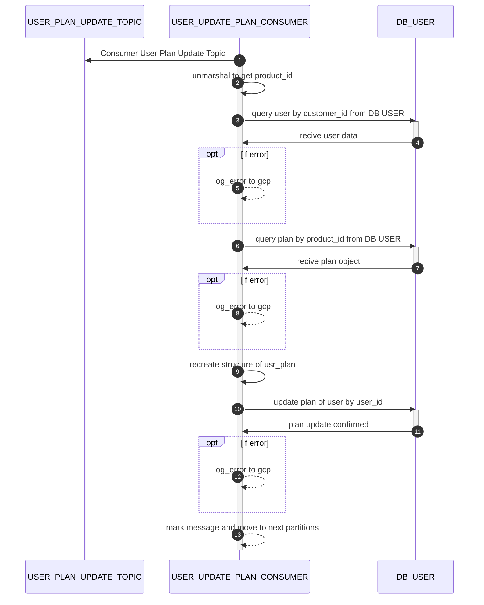

# user update plan consumer

Consume USER_PLAN_UPDATE_TOPIC




## Request
### Request Schema

| Field       | location | Type   | Mandatory(Man/Opt/Cond) | Target | Description |
| ----------- | -------- | ------ | ----------------------- | ------ | ----------- |
| product_id  | body     | string | M                       | -      | -           |
| customer_id | body     | string | M                       | -      | -           |


### Simple Request 

```json
{
    "product_id": "prod_P9mGurf84Qms1K",
    "customer_id":"cus_***********" 
}
```
