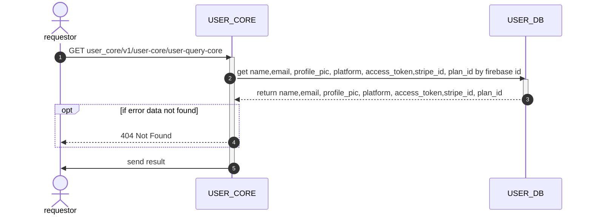

# GET user_core/v1/user-core/user-query-core

## Sequential Diagram



## Request Body

### Request Schema

| Field       | location | Type   | Mandatory(Man/Opt/Cond) | Target | Description |
| ----------- | -------- | ------ | ----------------------- | ------ | ----------- |
| firebase_id | body     | string | M                       | -      | -           |

### Sample Request

```json
{
    "firebase_id": "string"
}
```

## Response Body

### Response Schema

| Field        | location | Type   | Mandatory(Man/Opt/Cond) | Target | Description |
| ------------ | -------- | ------ | ----------------------- | ------ | ----------- |
| firebase_id  | body     | string | M                       | -      | -           |
| name         | body     | string | M                       | -      | -           |
| email        | body     | string | M                       | -      | -           |
| profile_pic  | body     | string | M                       | -      | -           |
| platform     | body     | string | M                       | -      | -           |
| access_token | body     | string | M                       | -      | -           |
| stripe_id    | body     | string | M                       | -      | -           |
| plan_id      | body     | string | M                       | -      | -           |

### Sample Response

```json
{
  "firebase_id": "string",
  "name":"sirin kub",
  "email":"mamoong.namplawan@gmil.com",
  "profile_pic":"something",
  "platform":"facebook",
  "access_token":"a3s4d5f6g7hjkp[6y7uixrctvybuji",
  "stripe_id":"crtvybuimotgyhujiyujik",
  "plan_id":"1"
}
```
