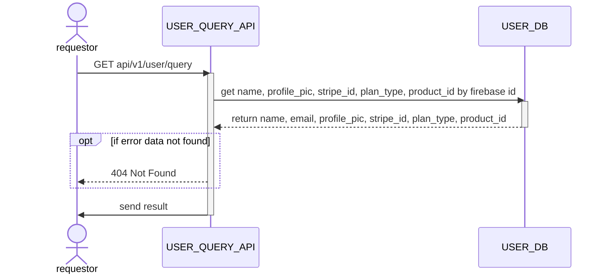

# GET api/v1/user/query

## Sequential Diagram



## Request Body

### Request Schema

| Field       | location | Type   | Mandatory(Man/Opt/Cond) | Target | Description |
| ----------- | -------- | ------ | ----------------------- | ------ | ----------- |
| firebase_id | body     | string | M                       | -      | -           |

### Sample Request

```json
{
    "firebase_id": "string"
}
```
