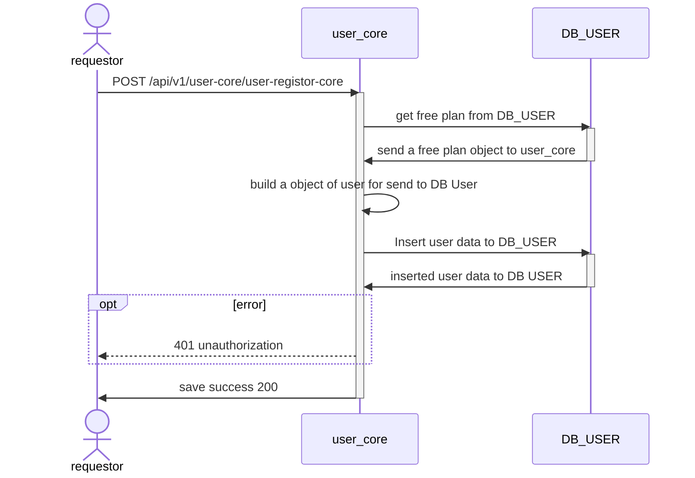

# POST /api/v1/user-core/user-registor-core

## Sequential Diagrams


## Request
### Request Schema


| Field       | location | Type   | Mandatory(Man/Opt/Cond) | Target | Description                        |
| ----------- | -------- | ------ | ----------------------- | ------ | ---------------------------------- |
| firebaseId  | body     | string | M                       | -      | -                                  |
| email       | body     | string | O                       | -      | -                                  |
| profilePic  | body     | string | O                       | -      | -                                  |
| platform    | body     | string | M                       | -      | Is Possible `gmail` and `facebook` |
| accessToken | body     | string | M                       | -      | -                                  |
| stripeID    | body     | string | M                       | -      | -                                  |

### Simple Request

```json
{
    "firebaseId": "string",
    "email": "string",
    "profilePic": "facebook.com/img",
    "platform": "google",
    "accessToken": "hashed-value-token",
    "stripeID": "cus_id"
}
```


## Response
### Response Schema


| Field      | location | Type   | Mandatory(Man/Opt/Cond) | Target | Description |
| ---------- | -------- | ------ | ----------------------- | ------ | ----------- |
| firebaseId | body     | string | M                       | -      | -           |
| email      | body     | string | O                       | -      | -           |
| profilePic | body     | string | O                       | -      | -           |
| stripeId   | body     | string | M                       | -      | -           |

### Simple Response

```json
{
    "firebaseId": "string",
    "email": "string",
    "profilePic": "facebook.com/img",
    "stripeId" : "string"
}
```