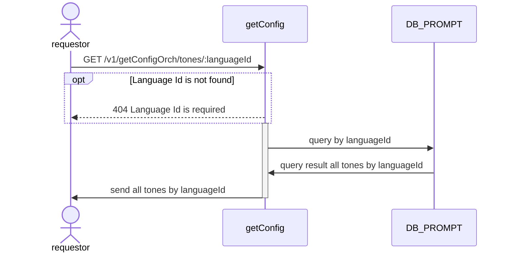
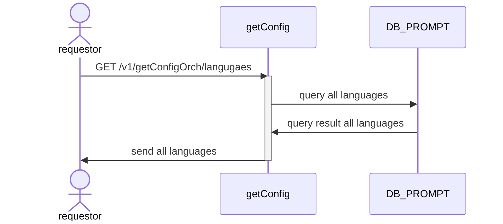

# GET api/v1/getConfigOrch/tones

## Sequential Diagram

## Request Body
### Request Schema

 Field         | location | Type   | Mandatory(Man/Opt/Cond) | Target | Description |
| ------------- | -------- | ------ | ----------------------- | ------ | ----------- |
| languageId    | params     | int    | M                       | -      | -           |

### Sample Request
```
{
    "languageId": 1
}
```
### Response
```
[
    {
        "id": 1,
        "name": "สนุกสนาน",
        "languageId": 1,
    },
    {
        "id": 2,
        "name": "มืออาชีพ",
        "languageId": 1,
    }
]
```

----
# GET api/v1/getConfigOrch/languages
## Sequential Diagram


## Request Body
None

### Response
```
[
    {
        "id": 1
        "name": "th"
    },
    {
        "id": 2
        "name": "en"
    },
    {
        "id": 3
        "name": "id"
    },
]
```
