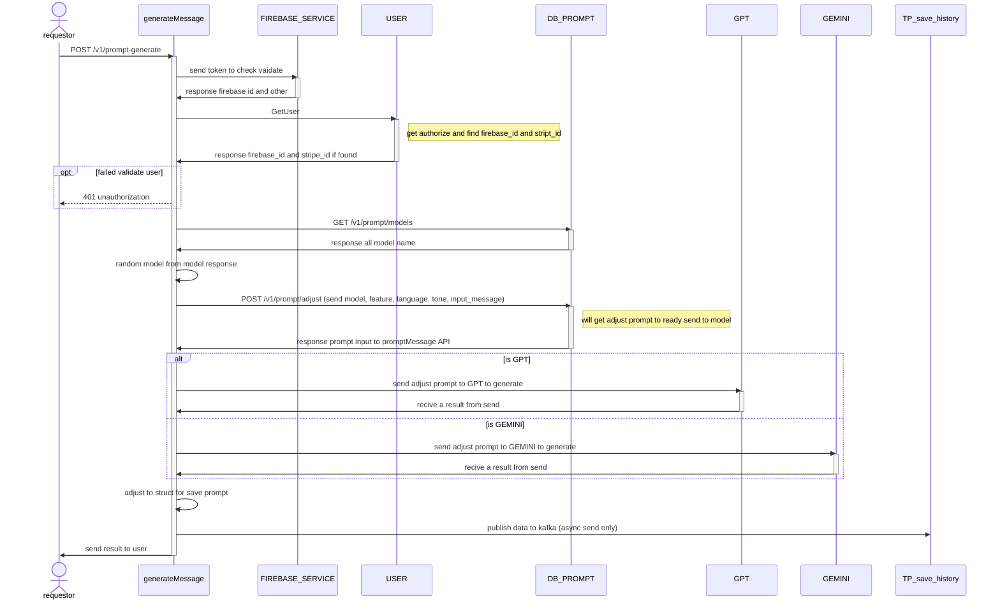

# POST api/v1/prompt-generate


## Sequential Diagram



## Request Body
### Request Schema

| Field         | location | Type   | Mandatory(Man/Opt/Cond) | Target | Description |
| ------------- | -------- | ------ | ----------------------- | ------ | ----------- |
| Authorization | header   | string | M                       | -      | -           |
| inputMessage  | body     | string | M                       | -      | -           |
| featureID     | body     | int    | M                       | -      | -           |
| languageID    | body     | int    | M                       | -      | -           |
| toneID        | body     | int    | M                       | -      | -           |

### Sample Request

```
{
    "inputMessage": "string",
    "featureID": 1,
    "languageID": 1,
    "toneID" : 1
}
```

