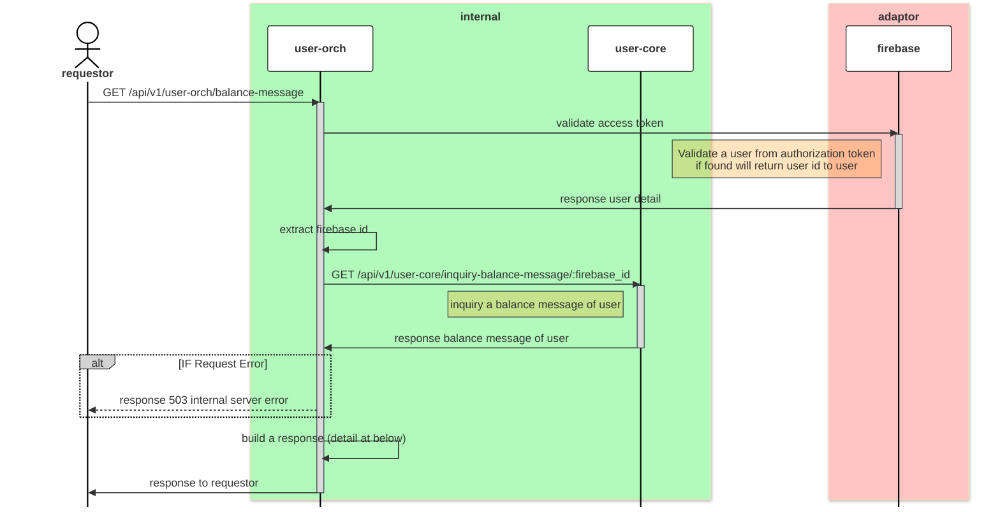

# GET /api/v1/user-orch/balance-message

 | Name                     | Detail                                                              |
 | ------------------------ | ------------------------------------------------------------------- |
 | **Overview**             | inquiry a account of user when `landing` and `login` to promptlabai |
 | **Layer**                | `ORCH`                                                              |
 | **Microservice**         | `user-orch`                                                         |
 | **Related to Service**   | `user-core`                                                         |
 | **Authentication Level** | `user level`                                                        |

### Change Log
| Date       | Update By                              | Description     |
| ---------- | -------------------------------------- | --------------- |
| 2024-05-18 | [@tanachod](https://github.com/Pet002) | initial Project |




## Request 
#### Header
| Field Name      | Location | Type   | Mandatory(M/O/C) | Source | Description |
| --------------- | -------- | ------ | ---------------- | ------ | ----------- |
| `Authorization` | HEADER   | string | M                |        |             |

### Request Schema
| Field Name | Location | Type | Mandatory(M/O/C) | Source | Description |
| ---------- | -------- | ---- | ---------------- | ------ | ----------- |
|            |          |      |                  |        |             |


### Sample Request
``` json
{

}
```

## Response
### Response Schema

| Field Name              | Type   | Mandatory(M/O/C) | Target | Description |
| ----------------------- | ------ | ---------------- | ------ | ----------- |
| `status`                | int    | M                |        |             |
| `code`                  | int    | M                |        |             |
| `data`                  | object | O                |        |             |
| `data`.`firebaseId`     | string | M                |        |             |
| `data`.`balanceMessage` | int    | M                |        |             |

### Sample Response
```json
{
    "status": 200,
    "code": 2000,
    "data": {
        "firebaseId": "if9012fds0asd",
        "balanceMessage": 999999999
    }
}
```

## Field to Field Mapping 

### Field mapping when call [firebase validate]()
| Target Field Name | Location | Tranformation | Mandatory (M/O/C) | Source                   | Remark       |
| ----------------- | -------- | ------------- | ----------------- | ------------------------ | ------------ |
| `Authorization`   |          | Direct        | M                 | `header`.`authorization` | Access token |

### Field mapping when call [GET /api/v1/prompt-core/balance-message/:firebase_id]()
| Target Field Name       | Location | Tranformation | Mandatory (M/O/C) | Source                                                                             | Remark |
| ----------------------- | -------- | ------------- | ----------------- | ---------------------------------------------------------------------------------- | ------ |
| `data`.`firebaseId`     |          | Direct        | M                 | [[GET /api/v1/prompt-core/balance-message/:firebase_id]()].`data`.`firebaseId`     |        |
| `data`.`balanceMessage` |          | Direct        | M                 | [[GET /api/v1/prompt-core/balance-message/:firebase_id]()].`data`.`balanceMessage` |        |