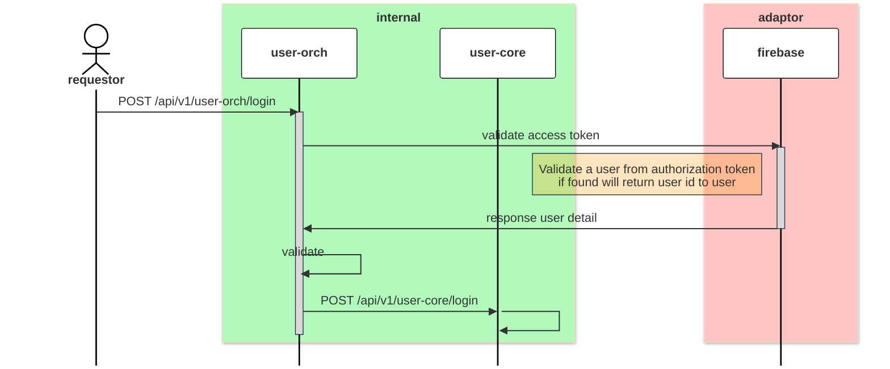

# POST /api/v1/user-orch/login

| Name                     | Detail                                                              |
| ------------------------ | ------------------------------------------------------------------- |
| **Overview**             | inquiry a account of user when `landing` and `login` to promptlabai |
| **Layer**                | `ORCH`                                                              |
| **Microservice**         | `user-orch`                                                         |
| **Related to Service**   | `user-core`                                                         |
| **Authentication Level** | `user level`                                                        |

### Change Log
| Date       | Update By                              | Description     |
| ---------- | -------------------------------------- | --------------- |
| 2024-05-18 | [@tanachod](https://github.com/Pet002) | initial Project |

