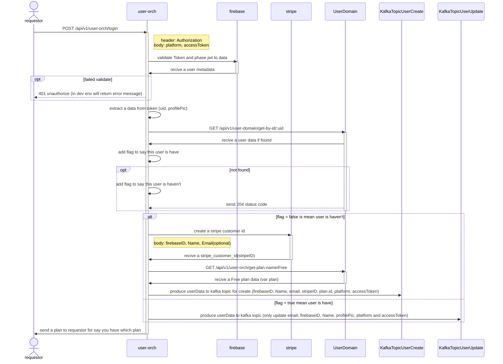

# POST /api/v1/user-orch/login

## Sequential Diagrams

```mermaid
sequenceDiagram
    actor req as requestor
    participant usrOrch as user-orch
    participant firebase as firebase
    participant stripe as stripe
    participant user as UserDomain
    participant kUserC as KafkaTopicUserCreate
    participant kUserU as KafkaTopicUserUpdate

    req ->> usrOrch : POST /api/v1/user-orch/login
    activate usrOrch 
    note right of usrOrch: header: Authorization<br/>body: platform, accessToken
    usrOrch ->> firebase: validate Token and phase jwt to data
    activate firebase
    firebase ->> usrOrch: recive a user metadata
    deactivate firebase
    opt failed validate
        usrOrch -->> req: 401 unauthorize (in dev env will return error message)
    end

    usrOrch ->> usrOrch: extract a data from token (uid, profilePic)
    
    usrOrch ->> user: GET /api/v1/user-domain/get-by-id/:uid
    activate user
    user ->> usrOrch: recive a user data if found
    usrOrch ->> usrOrch : add flag to say this user is have

    opt not found
    usrOrch ->> usrOrch : add flag to say this user is haven't
        user -->> usrOrch: send 204 status code 
    end
    deactivate user

    alt flag = false is mean user is haven't

        usrOrch ->> stripe: create a stripe customer id
        activate stripe
        note right of usrOrch: body: firebaseID, Name, Email(optional)
        stripe ->> usrOrch: recive a  stripe_customer_id(stripeID)
        deactivate stripe
        
        usrOrch ->> user: GET /api/v1/user-orch/get-plan-name/Free
        activate user
        user ->> usrOrch: recive a Free plan data (var plan)
        deactivate user
        
        usrOrch ->> kUserC: produce userData to kafka topic for create (firebaseID, Name, email, stripeID, plan.id, platform, accessToken)
    
    else flag = true mean user is have
        usrOrch ->> kUserU: produce userData to kafka topic (only update email, firebaseID, Name, profilePic, platform and accessToken)
    end

    usrOrch ->> req: send a plan to requestor for say you have which plan


    deactivate usrOrch 

```